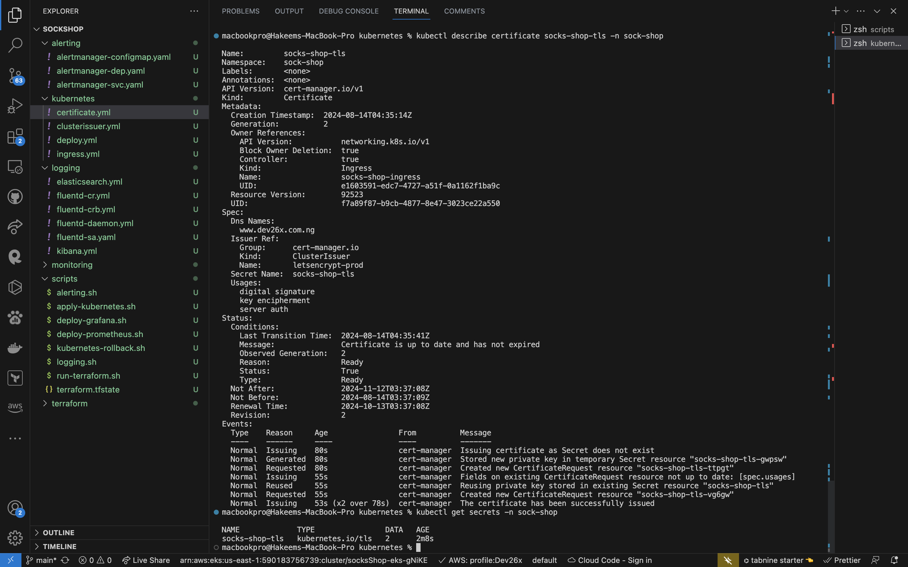
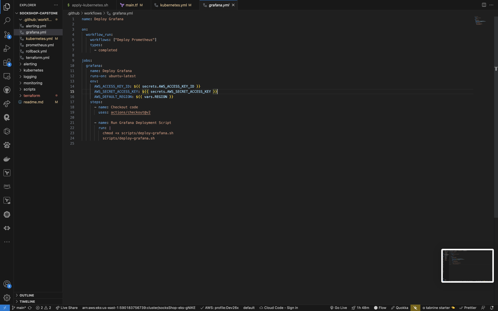

# Microservices Deployment with IaC and CI/CD

## Project Overview

This project demonstrates a complete setup for deploying microservices using Infrastructure as Code (IaC) with Terraform and Kubernetes. It includes a robust CI/CD pipeline using GitHub Actions, along with monitoring and alerting solutions.


## Table of Contents

1. [Features](#features)
2. [Prerequisites](#prerequisites)
3. [Project Structure](#project-structure)
4. [Setup](#setup)
5. [Infrastructure (Terraform)](#infrastructure-terraform)
6. [Kubernetes Deployment](#kubernetes-deployment)
7. [Monitoring and Logging](#Monitoring-and-Logging)
8. [Alerting](#alerting)
9. [Scripts](#scripts)
10. [CI/CD Pipeline](#cicd-pipeline)
11. [Result](#Result)


## Features

- Infrastructure as Code using Terraform
- Kubernetes deployment with NGINX Ingress and Cert-Manager
- Monitoring with Prometheus and Grafana
- Alerting with Alertmanager
- Comprehensive CI/CD pipeline with GitHub Actions

## Prerequisites

- AWS Account
- GitHub Account
- Terraform (v1.3 or later)
- kubectl
- Helm

## Project Structure

```
.
├── .github/workflows/
│   ├── terraform.yml
│   ├── kubernetes.yml
│   ├── monitoring.yml
│   └── alerting.yml
├── Alerting/
│   ├── alertmanager-configmap.yml
│   ├── alertmanager-dep.yml
│   └── alertmanager-svc.yml
├── Monitoring/
│   ├── [Prometheus & Grafana configuration files]
├── Kubernetes/
│   ├── certificate.yml
│   ├── clusterissuer.yml
│   ├── deploy.yml
│   └── ingress.yml
├── Scripts/
│   ├── run-terraform.sh
│   ├── apply-kubernetes.sh
│   ├── deploy-prometheus.sh
│   ├── deploy-grafana.sh
│   ├── alerting.sh
│   └── rollback.sh
└── Terraform/
├── main.tf
├── outputs.tf
├── provider.tf
├── terraform.tf
└── variables.tf

```

## Setup

1. Clone this repository:
git clone https://github.com/Dev26x/sockshop.git
cd sockshop
Copy
2. Set up AWS credentials:
- Create an IAM user with appropriate permissions
- Configure AWS CLI with the credentials

3. Set up GitHub Secrets:
- AWS_ACCESS_KEY_ID
- AWS_SECRET_ACCESS_KEY
- AWS_CLUSTER_NAME

4. Set up GitHub Variables:
- AWS_REGION (e.g., us-east-1)


## Infrastructure (Terraform)

The infrastructure is managed using Terraform. Key components include:

- VPC with public and private subnets
- EKS cluster with managed node groups


## Kubernetes Deployment

The project uses Kubernetes for orchestrating the microservices. Key components:


- NGINX Ingress Controller
- Cluster Issuer
- Cert-Manager for SSL/TLS
- Microservices deployment
- Ingress

By running the kubernetes script, these files are installed/applied to deploy microservices, issue certificate and secure the domain.

View all services and deployments using:  `kubectl get all -A`


Certificate issued:


*Remember to create A records in your domain dns pointing to the load balancer, and also create the same A record in your route 53 hosted zone.*

## Monitoring and Logging


Monitoring and logging  is set up using Prometheus and Grafana.

I exposed prometheus and grafana to my dash board using port forwarding with these command:
```
kubectl port-forward service/prometheus 31090:9090 -n monitoring

kubectl port-forward service/grafana 31300:3000 -n monitoring

```


I also edited my prometheus errror rules to aid the alert manager with metrics for alerting.


## Alerting

By running the alerting.sh script, Alerting is configured with Alertmanager, which routes alerts to Slack.

Slack Alert


By port-forwarding, alert manager can be viewed in the browser.


## Scripts

### Terraform script


Purpose: Manages infrastructure provisioning and updates using Terraform.
- Terraform Initialization and Apply: The script initializes Terraform and applies the configuration to set up infrastructure resources, such as VPCs, EKS clusters, and other components.
- Outputs Variables: Outputs essential variables needed by subsequent workflows (e.g., Kubernetes cluster name, region).


### Kubernetes Script


Purpose: Deploys Kubernetes resources.
- Applies Kubernetes manifests using kubectl.
- Ensures that all necessary Kubernetes objects (e.g., Deployments, Services, Ingresses) are created or updated.


### Monitoring and Logging Scripts

Prometheus 


Purpose: Deploys Prometheus monitoring tool.
- Applies Prometheus manifests to the Kubernetes cluster.
- Configures Prometheus for monitoring.


Grafana 


Purpose: Deploys Grafana for visualization.
- Applies Grafana manifests to the Kubernetes cluster.
- Sets up Grafana dashboards and configurations.


### Alerting Script


Purpose: Configures and deploys alerting setups.
- Applies alerting configurations, such as Alertmanager and related alerting rules.
- Sets up the alerting pipeline to integrate with Prometheus.


## CI/CD Pipeline

The CI/CD pipeline is implemented using GitHub Actions and consists of four workflows:

1. Terraform

    


2. Kubernetes Deployment

    


3. Monitoring and Logging

    Prometheus workflow
    


    Grafana workflow
    


4. Alerting

    


## Result

The application is accessible on my domain (www.dev26x.com.ng) over HTTPS and secured using Let’s Encrypt for certificates.


